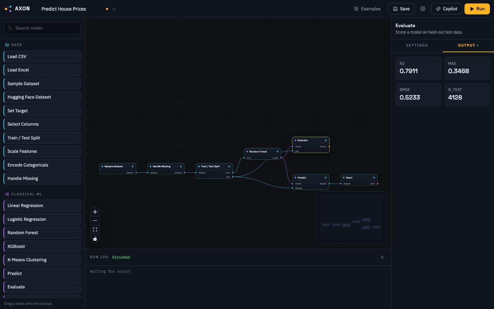

<div align="center">

# Axon

**Build real AI visually. Train, fine-tune, and orchestrate machine learning models on your own machine, without writing code.**

[](https://github.com/Samyrrrrrr990/axon/actions/workflows/ci.yml)
[](LICENSE.md)
[](pyproject.toml)
[](CONTRIBUTING.md)

[Quickstart](#quickstart) ·
[Examples](#examples) ·
[Nodes](#node-reference) ·
[Architecture](docs/architecture.md) ·
[Contributing](CONTRIBUTING.md) ·
[License](#license)

</div>

---

Axon is a visual, node-based workspace for machine learning, in the way n8n is a visual workspace for automation. You drag nodes onto a canvas, wire them together, and press Run. The graph loads your data, trains a model, evaluates it, and charts the results. The same canvas covers LoRA fine-tuning of pretrained language models and LLM pipelines with retrieval and agents.

Everything runs locally. Your data stays on your machine unless you connect a cloud model provider yourself.



## Features

- **Real model training.** scikit-learn, XGBoost, and PyTorch run locally. Training nodes stream their loss curves to the canvas in real time.
- **Visual fine-tuning.** LoRA fine-tuning of Hugging Face models is a five-node graph: load, tokenize, tune, generate, save.
- **LLM pipelines and agents.** Retrieval over your own documents, structured extraction, tool definitions, and agent loops. Works with free OpenRouter models, Anthropic, OpenAI, or local Ollama.
- **A copilot that edits the graph.** Describe what you want and the copilot adds configured, wired nodes. It emits validated graph operations, never arbitrary code, and every change can be undone.
- **Incremental caching.** Node outputs are cached by content. Change one node and only the affected part of the pipeline recomputes.
- **Portable workflows.** Each workflow is a single `.axon.json` file with no machine-specific paths. Send it to a colleague and it opens on their machine.
- **Code when you want it.** A Python node accepts arbitrary code for anything the built-in nodes do not cover.

## Quickstart

Axon needs [uv](https://docs.astral.sh/uv/), which manages its Python environment for you:

```bash
curl -LsSf https://astral.sh/uv/install.sh | sh
```

Then:

```bash
git clone https://github.com/Samyrrrrrr990/axon.git
cd axon
./axon.sh
```

Your browser opens at `http://localhost:8700` with a gallery of examples. Open "Predict House Prices", press Run, and watch a model train.

The core install is small. Heavier capabilities (PyTorch, Transformers, vector search) are grouped into packs that install with one click the first time a workflow needs them.

Workflows also run headless, which is how CI runs them:

```bash
uv run python -m axon run examples/house-prices.axon.json
```

## Examples

Five example workflows ship with the app and open from the in-app gallery.

| Example | Domain | Requirements |
|---|---|---|
| Predict House Prices | Classical ML | none, runs offline |
| Handwritten Digit Classifier | Deep learning | `deep` pack (PyTorch) |
| Fine-tune a Tiny LLM | Fine-tuning | `finetune` pack |
| Chat With Your Documents | Retrieval | `rag` pack, one API key |
| Research Agent | Agents | one API key |

The API key for the last two can be a free key from [openrouter.ai/keys](https://openrouter.ai/keys).

## Node reference

Axon ships with 47 nodes in six groups.

| Group | Nodes |
|---|---|
| Data | CSV and Excel loaders, sample datasets, Hugging Face datasets, train/test split, scaling, encoding, imputation |
| Classical ML | linear and logistic regression, random forest, XGBoost, k-means, evaluation, confusion matrix, prediction |
| Deep learning | MLP and CNN builders, PyTorch trainer with live loss, evaluation, export to ONNX and TorchScript |
| Fine-tuning | pretrained model loader, tokenizer, LoRA fine-tuning, text generation, adapter export |
| LLM and agents | chat models, prompt templates, structured extraction, embeddings, vector store, retrieval, tools, agent loop |
| Utility | Python code, charts, table and metric viewers, text input and output, file export |

A node is a decorated Python function. The palette entry, form fields, typed sockets, and output previews are all generated from its declaration, so adding a node takes about 20 lines. See [docs/writing-nodes.md](docs/writing-nodes.md).

## The copilot

The copilot reads your current graph and the node catalog, then answers questions or edits the graph directly. It communicates in a restricted operations format (add node, connect, set parameters), and every edit is validated against the type system before it reaches your canvas.

By default it uses a free model through OpenRouter. You can switch to Anthropic, OpenAI, or a local Ollama model in Settings. Keys are stored locally and are only sent to the provider you choose.

## Architecture

One Python process serves the REST and WebSocket API and the built React frontend. The execution engine runs workflows in topological order on worker threads, streams per-node status and metrics over WebSocket, and caches node outputs on disk. See [docs/architecture.md](docs/architecture.md) for the full picture.

| Layer | Technology |
|---|---|
| Frontend | React, TypeScript, React Flow, Zustand, Tailwind CSS, Recharts |
| API | FastAPI, WebSocket, Pydantic |
| Engine | pure Python, content-addressed caching, SQLite run history |
| ML | scikit-learn, XGBoost, PyTorch, Transformers, PEFT, ChromaDB |

## Project status

Axon is at v0.1. The engine, all six node packs, the copilot, and the examples are covered by 120 tests plus an end-to-end browser test, and CI runs the full suite on every push. APIs may still change between minor versions.

Planned next: community node packs with automatic discovery, a workflow sharing gallery, experiment tracking with run comparison, and a hosted option for teams.

## Contributing

The most useful contribution is a node pack. A node is a small Python function and the UI comes free; [CONTRIBUTING.md](CONTRIBUTING.md) walks through writing your first one. Bug reports with a `.axon.json` file attached are easy to reproduce and very welcome.

## License

Axon is licensed under [PolyForm Noncommercial 1.0.0](LICENSE.md).

- **Free** for academic research, non-profit organizations, personal projects, education, and evaluation.
- **Commercial use requires a license.** See [COMMERCIAL_LICENSE.md](COMMERCIAL_LICENSE.md) for how to get one.

Commercial licensing is what funds free access for researchers. If you are unsure which side you fall on, open an issue and ask.
